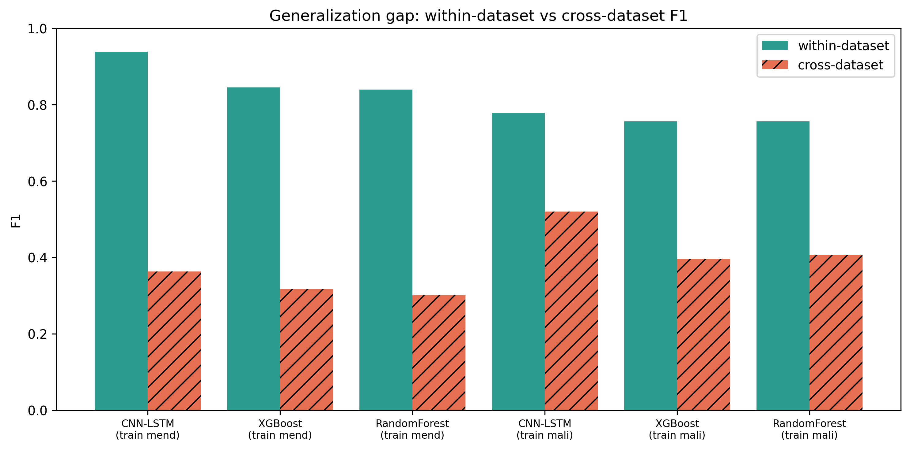

# Phishing Detection Benchmark

Published phishing detectors report accuracy numbers close to perfect. This
project asked a simpler question about them: if a model is that good at
recognising a fraudulent link, does it stay good when you show it links that
came from somewhere else? Nine models were trained under one shared protocol,
scored the usual way, and then scored again on a corpus they had never seen.

**In one sentence:** it measures the distance between how good a phishing
detector looks on its own test data and how good it actually is.

This is the extension of a Scientific Initiation (Iniciação Científica) carried
out at SENAI Antonio Adolpho Lobbe by Otávio Fernandes Temoteo.

---

## What it's for

Almost every paper on phishing detection follows the same shape. Take a public
dataset of URLs, split it into training and test halves, train a model, report
the score on the test half. The scores that come back are extraordinary: F1
above 0.95, AUC above 0.99. Read enough of them and the problem looks solved.

The obvious thing that shape cannot tell you is whether the model learned what a
phishing URL is, or learned what *this collection of URLs* looks like. Those two
are indistinguishable when you only ever test on a held-out slice of the same
collection, and they come apart completely the moment the model sees traffic
that somebody else gathered, on a different day, with different conventions.
That gap is what this benchmark measures, in both directions, with the
within-dataset baseline measured under identical conditions so the two numbers
can honestly be put side by side.

The trade is that it does not produce a detector. There is no model file at the
end of this to put in front of real traffic, and it makes no attempt to build a
better classifier than the ones it compares. It is a measurement, and it spends
its whole budget on making that measurement trustworthy rather than on making
any single number look good: fixed seeds, hashed datasets, a manifest per
experiment, a full re-run from scratch on a later date to prove the numbers hold.
The second trade is narrower: every corpus here is URL-derived, whether that is
the raw string or features extracted from it, so nothing in these results says
anything about detectors that read page content, certificates, or domain age.
What can be concluded is bounded by that, and the limitations section says so
rather than leaving it implied.

## What you actually do with it

**First, one form, once.** Three of the four corpora fetch themselves with no
account and no token. The fourth, ISCX-URL2016, is distributed by UNB CIC behind
a registration form, so you fill it in, drop the CSV into `data/`, and that is
the last manual thing you do. Everything after this point is automatic.

**Then two commands, and about two hours.** An environment check runs first,
because a benchmark that half-runs on the wrong library version produces numbers
that look fine and are not. Then one command walks the whole thing: exploratory analysis, eighteen classical experiments across
three datasets, three character-level neural networks, then the cross-dataset
transfer test in both directions, then the figures. Every experiment writes its
metrics, its computational cost, and a JSON manifest recording the exact code,
data hash, hyperparameters and seed behind it.

**What comes out is two folders and one conclusion.** `results/` holds the
metric tables and the manifests; `plots/final/` holds the figures at print
resolution. The number worth looking at first is not any model's score. It is
the distance between the two bars in the generalization figure, which is the
whole finding in one picture.

## What came out

**Within its own dataset, everything works.** Tree ensembles and character-level
networks reach 0.94 to 0.999 AUC on their own held-out test sets. On raw URLs the
character-level models beat every classical model by roughly eight F1 points,
which is the expected result: learned representations do better than hand-written
lexical features when the input is the raw string.

| Dataset | Best model | F1 | AUC |
|---|---|---|---|
| UCI, 30 expert features | Random Forest | 0.967 | 0.997 |
| Mendeley, raw URLs, classical | XGBoost / CatBoost | 0.857 | 0.960 |
| Mendeley, raw URLs, deep | LSTM | 0.937 | 0.991 |
| ISCX-URL2016, 79 lexical features | XGBoost | 0.987 | 0.999 |

**Across datasets, all of it collapses.** Train on one raw-URL corpus, test on
another, and F1 falls from a range of 0.76 to 0.94 down to 0.30 to 0.52, with AUC
between 0.45 and 0.64, at or below what guessing gets you. The best
within-dataset model, the character-level CNN-LSTM, transfers no better than the
simplest lexical ones, and in one direction lands below 0.5, meaning its ranking
of which URL is more suspicious has partially inverted. The scores in the table
above are, to a large extent, the models having memorised a corpus.



**The collapse is real, and there is a control to prove it.** The first
diagnostic run transferred at random for a reason that had nothing to do with
phishing: roughly 100% of the URLs in one corpus carry the `http://` scheme
against about 11.5% in the other, so features like URL length and presence of
HTTPS were encoding a data-collection habit. Stripping the scheme from both
corpora and re-measuring the baseline under the same normalisation removes that
confound, and the collapse survived it. Cost, meanwhile, varies by three orders
of magnitude for the same accuracy: Logistic Regression trains in 1.5 seconds
against Random Forest's 547.8, and the LSTM costs about 2.9 times the plain CNN's
training time to buy 1.4 F1 points.

The full tables, every figure, and the interpretation are in
[`docs/RESULTS.md`](docs/RESULTS.md).

## The ideas behind it

- **A result you cannot re-run is an anecdote, and reproducibility has a
  boundary worth naming.** One seed, pinned versions, a SHA-256 per dataset, and
  a manifest tying every experiment's numbers to the commit that produced them.
  Re-run from scratch two weeks later on the same machine, all 33 experiments
  came back with identical metric values. Re-run on a different platform they do
  not, and the gap is uneven: the tree models still agree to the third decimal,
  the neural ones move by up to 0.074, and the ones that move are exactly the
  ones that trained on a GPU there and on a CPU here. Adding Windows as a third
  platform turned that observation into a test it could have failed. Sharing
  x86-64 and OpenBLAS with Linux, its classical runs tightened to a median gap
  of zero with 54% of metrics bit-identical, while its neural runs, on CPU like
  macOS's, moved just as much as macOS's did. The divergence tracks its cause,
  not the operating system. Every conclusion survives on all three and no single
  digit does. Bitwise reproducibility is a property of a platform, not of a
  pipeline, and saying so is more useful than a claim that quietly fails on
  somebody else's laptop.
- **Both halves of a comparison must be measured the same way, and cost counts as
  a half.** The transfer number is only interesting beside a within-dataset
  baseline built under identical preprocessing and normalisation. Training time,
  latency, memory and parameter count are recorded next to accuracy for the same
  reason: a model one F1 point better and three times slower has not obviously
  won.
- **A surprising result gets a control before it gets a conclusion.** The
  generalization gap was the interesting finding, which is exactly why the first
  job was trying to explain it away as a formatting artifact. It survived. The
  phase that was deliberately dropped, transformers, is recorded with its
  reasoning too, rather than left as a silent gap in the comparison.

## Who can use it

Anyone. The code is MIT-licensed and everything needed to reproduce the results
is in the repository. There is exactly one manual step in the whole process,
filling in UNB CIC's registration form for ISCX-URL2016, and it is free and
takes a minute.
The figures and tables may be used with attribution to the dissertation cited at
the bottom of this file.

## Where the data comes from

Nothing is redistributed here. The datasets belong to their original providers,
keep their original licenses, and none is committed to the repository. What is
committed is the SHA-256 of each, so a run on your machine can prove it used the
same bytes as the run that produced these numbers, and a corpus that quietly
changes upstream fails loudly instead of shifting the results.

**Three datasets carry the study.** Each is a curated academic release, and each
is evaluated in the within-dataset stage.

| Dataset | Size | Representation | How you get it |
|---|---|---|---|
| [UCI Phishing Websites](https://archive.ics.uci.edu/dataset/327/phishing+websites) | 11,055 | 30 expert-extracted features | automatic |
| [Mendeley n96ncsr5g4/1](https://data.mendeley.com/datasets/n96ncsr5g4/1) | 80,000 | raw URL and label | automatic |
| [ISCX-URL2016](https://www.unb.ca/cic/datasets/url-2016.html) | 36,707 | 79 lexical features | manual, registration form |

**A fourth corpus appears in the cross-dataset stage only.**
[Malicious URLs](https://www.kaggle.com/datasets/sid321axn/malicious-urls-dataset),
roughly 522,214 labelled URLs once the phishing and benign classes are selected,
fetched automatically through Kaggle's anonymous public API. It was added because
the original plan could not survive contact with the data: the transfer test was
meant to run Mendeley against ISCX, both as raw URLs, but the public distribution
of ISCX contains only pre-extracted lexical attributes, which rules it out as
Mendeley's counterpart under the character-level representation the deep models
need. Malicious URLs is deliberately not a fourth main dataset, being an
aggregation of public sources rather than a curated release, so its scale and
heterogeneity are an advantage exactly where they are used and it is never
evaluated within-dataset.

Schemas, caveats and the hash registry: [`data/README.md`](data/README.md).

---

## For developers

| Document | What's in it |
|---|---|
| [`docs/RESULTS.md`](docs/RESULTS.md) | Every result, figure and interpretation. Start here to see what came out |
| [`docs/SETUP.md`](docs/SETUP.md) | Installing, fetching data, running the pipeline whole or in pieces |
| [`docs/DECISIONS.md`](docs/DECISIONS.md) | Ten decision records covering every non-trivial methodological choice |
| [`docs/DEVELOPMENT.md`](docs/DEVELOPMENT.md) | Stack, conventions, roadmap, and the reproducibility protocol in full |
| [`docs/EXPERIMENT_LOG.md`](docs/EXPERIMENT_LOG.md) | Chronological lab journal of every experiment session |

Linux is the reference platform. All 33 experiments also run end to end on
macOS and on Windows, with the numerical caveat above; `docs/SETUP.md` has the
full comparison. Windows runs natively under Git Bash and does not need WSL.

```bash
git clone https://github.com/otaviotemoteo/phishing-detection-benchmark.git
cd phishing-detection-benchmark
python3.11 -m venv .venv && source .venv/bin/activate   # Windows: .venv/Scripts/activate
pip install -r requirements.txt
brew install libomp                  # macOS only: XGBoost needs the OpenMP runtime
python scripts/verify_environment.py

bash scripts/download_datasets.sh    # fetches 3 of 4; prints the form link for ISCX
# fill in the UNB CIC form, put iscx_url2016.csv in data/, then:
bash scripts/download_datasets.sh    # picks it up and writes the hash registry

bash scripts/run_all.sh              # about 2 h on the reference machine
```

Python 3.11, scikit-learn and imbalanced-learn for the classical pipelines,
XGBoost and CatBoost for the boosted trees, PyTorch for the character-level
networks, MLflow for run tracking, matplotlib for the figures.

## License and citation

Code under the MIT License. Datasets keep their original licenses, listed in
[`data/README.md`](data/README.md).

> TEMOTEO, O. F. Uso de Inteligência Artificial na Detecção de Ataques de
> Phishing. 2026. Trabalho de Iniciação Científica, SENAI Antonio Adolpho Lobbe,
> São Carlos, 2026.
