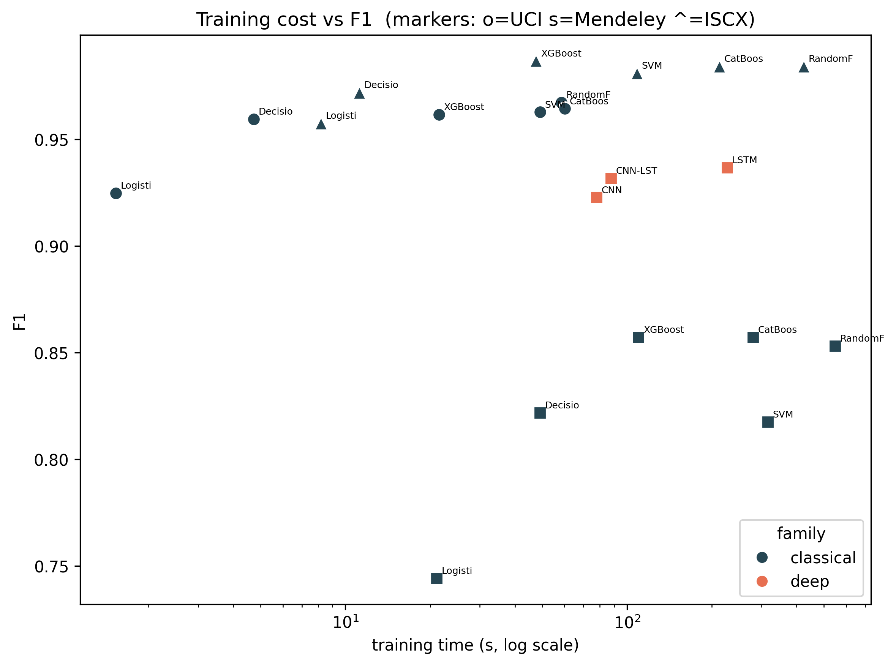
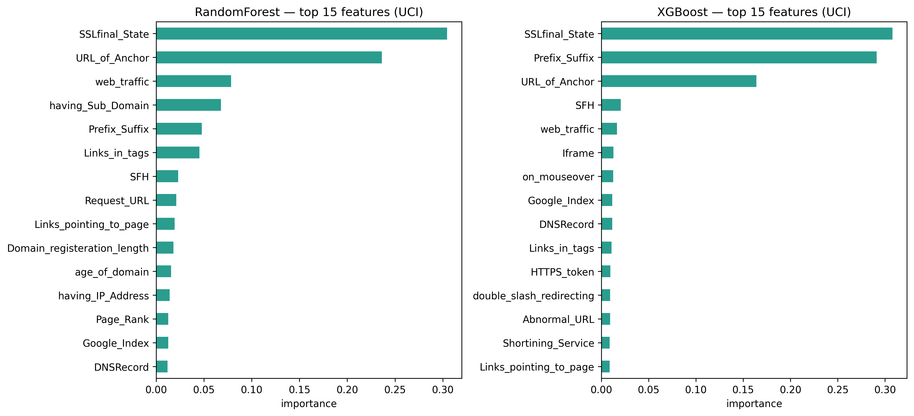
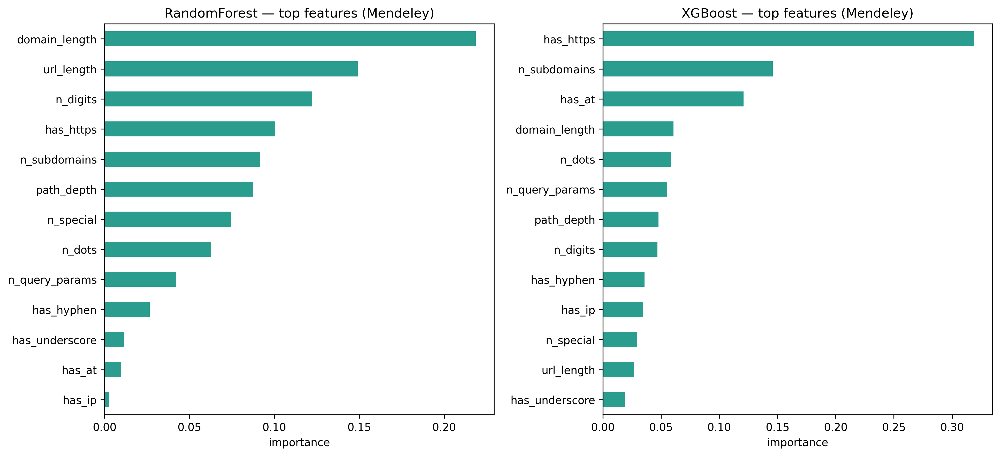

# Results

All results of the experimental phase (Phases 1–7), with the figures and the interpretation. Every number here comes from `results/metrics_ml.csv`, `results/metrics_dl.csv`, or `results/metrics_crossdataset.csv` (values rounded to 3 decimals; the CSVs and the JSON manifests in `results/manifests/` are the source of truth). Phishing is the positive class in all metrics ([D-004](DECISIONS.md)).

**Scope.** Two model families were evaluated: Classical ML (6 models × 3 datasets, tuned with RandomizedSearchCV inside leakage-safe pipelines — [D-006](DECISIONS.md)) and Deep Learning (3 character-level architectures on Mendeley, the only corpus with raw URLs — [D-007](DECISIONS.md), [D-008](DECISIONS.md)). Transformer fine-tuning (Phase 5) was deliberately skipped with documented justification ([D-009](DECISIONS.md)). Phase 6 adds a cross-dataset generalization test ([D-010](DECISIONS.md)).

## 1. Within-dataset performance

### Classical ML (18 experiments)

| Dataset | Model | Accuracy | Precision | Recall | F1 | AUC | Train (s) |
|---|---|---|---|---|---|---|---|
| UCI | Decision Tree | 0.964 | 0.971 | 0.948 | 0.959 | 0.977 | 4.7 |
| UCI | Random Forest | 0.971 | 0.970 | 0.965 | **0.967** | 0.997 | 58.4 |
| UCI | XGBoost | 0.966 | 0.972 | 0.951 | 0.962 | 0.997 | 21.5 |
| UCI | CatBoost | 0.969 | 0.972 | 0.957 | 0.964 | 0.997 | 60.1 |
| UCI | Logistic Regression | 0.934 | 0.931 | 0.918 | 0.925 | 0.980 | 1.5 |
| UCI | SVM | 0.968 | 0.979 | 0.947 | 0.963 | 0.996 | 49.1 |
| Mendeley | Decision Tree | 0.867 | 0.828 | 0.816 | 0.822 | 0.887 | 49.1 |
| Mendeley | Random Forest | 0.890 | 0.851 | 0.856 | 0.853 | 0.956 | 547.8 |
| Mendeley | XGBoost | 0.892 | 0.851 | 0.863 | **0.857** | 0.960 | 109.9 |
| Mendeley | CatBoost | 0.893 | 0.862 | 0.853 | **0.857** | 0.959 | 280.0 |
| Mendeley | Logistic Regression | 0.800 | 0.715 | 0.776 | 0.744 | 0.881 | 21.1 |
| Mendeley | SVM | 0.859 | 0.792 | 0.844 | 0.818 | 0.937 | 316.3 |
| ISCX | Decision Tree | 0.973 | 0.986 | 0.958 | 0.972 | 0.973 | 11.2 |
| ISCX | Random Forest | 0.984 | 0.991 | 0.977 | 0.984 | 0.999 | 424.2 |
| ISCX | XGBoost | 0.987 | 0.993 | 0.981 | **0.987** | 0.999 | 47.5 |
| ISCX | CatBoost | 0.984 | 0.992 | 0.976 | 0.984 | 0.999 | 212.5 |
| ISCX | Logistic Regression | 0.958 | 0.955 | 0.961 | 0.958 | 0.992 | 8.2 |
| ISCX | SVM | 0.981 | 0.986 | 0.976 | 0.981 | 0.997 | 108.5 |

Reading: tree ensembles (RF/XGBoost/CatBoost) top every dataset; XGBoost is the most consistent. Logistic Regression is the floor, SVM sits in between (trained on a stratified 15k cap on Mendeley — [D-006](DECISIONS.md)). **Mendeley is clearly the hardest corpus** (best classical F1 0.857): its models see only 13 lexical features derived from the URL string, versus UCI's 30 expert features and ISCX's 79-feature export — the representation, not the algorithm, is the bottleneck.

### Deep Learning on Mendeley (char-level, raw URLs)

| Model | Accuracy | Precision | Recall | F1 | AUC | Train (s) | Params |
|---|---|---|---|---|---|---|---|
| CNN | 0.940 | 0.899 | 0.948 | 0.923 | 0.987 | 78.1 | 23,617 |
| LSTM | 0.951 | 0.912 | 0.963 | **0.937** | 0.991 | 226.9 | 94,145 |
| CNN-LSTM | 0.949 | 0.933 | 0.930 | 0.932 | 0.988 | 87.7 | 65,025 |

**All three deep models beat all six classical models on Mendeley** — LSTM 0.937 vs XGBoost 0.857, an ~8-point F1 gap. Learning directly from the character sequence captures signal the 13 hand-crafted features miss. Note the hybrid CNN-LSTM does *not* beat the plain LSTM here (unlike Alshingiti et al. 2023, who fed tabular features rather than raw sequences).

Figures: [metric bars](../plots/final/metric_bars.png) · [ROC overlays](../plots/final/roc_overlay.png) · [F1 heatmap](../plots/final/f1_heatmap.png) · [confusion matrices (Mendeley)](../plots/final/confusion_grid_mendeley.png)

## 2. Computational cost

- Training time spans **three orders of magnitude** for comparable accuracy: Logistic Regression 1.5 s (UCI) vs Random Forest 547.8 s (Mendeley). XGBoost delivers RF-level (or better) F1 at ~1/5 of RF's training cost on the large datasets.
- The LSTM costs ~2.9× the CNN's training time (226.9 s vs 78.1 s) and ~3× its inference latency for +1.4 F1 points — the clearest quality-vs-cost trade-off in the study.
- Inference is real-time-compatible everywhere: boosting models at 0.002–0.007 ms/sample, deep models at 0.026–0.088 ms/sample; SVM is the outlier at 0.304 ms/sample (Mendeley).
- The whole DL phase fit comfortably in the 3 GB GPU (~650–694 MB peak, fp16, batch 64); early stopping fired at 13–15 epochs.

## 3. What the tree models look at

On UCI, Random Forest and XGBoost agree on the dominant feature — `SSLfinal_State` (~0.30 of total importance in both) — followed by link structure (`URL_of_Anchor`) and domain morphology (`Prefix_Suffix`). RF spreads importance more evenly (bagging); XGBoost concentrates it (boosting).

On Mendeley (13 lexical features), the two models diverge more: RF leans on length/count features (`domain_length`, `url_length`, `n_digits`), XGBoost concentrates on `has_https` (~0.32) and `n_subdomains`. `has_https` ranking first is itself a warning sign for generalization — scheme presence is exactly the kind of corpus-specific convention the cross-dataset test exposed (below).

## 4. Cross-dataset generalization — the central finding

**Protocol** ([D-010](DECISIONS.md)): train on corpus A (stratified cap 80k, same tuning as Phase 3), evaluate the *same fitted model* twice — on A's held-out test set (the *within* baseline) and on all of corpus B (*cross*). Both directions, Mendeley ↔ Malicious URLs; both corpora reduced to the same representation (13 lexical features for RF/XGBoost, char sequences for CNN-LSTM); URLs normalized by stripping the `http(s)://` scheme.

| Model | Train | Test | Accuracy | Precision | Recall | F1 | AUC |
|---|---|---|---|---|---|---|---|
| Random Forest | Mendeley | Mendeley | 0.880 | 0.841 | 0.839 | 0.840 | 0.950 |
| Random Forest | Mendeley | Malicious URLs | 0.611 | 0.223 | 0.465 | **0.301** | 0.603 |
| XGBoost | Mendeley | Mendeley | 0.885 | 0.852 | 0.839 | 0.845 | 0.953 |
| XGBoost | Mendeley | Malicious URLs | 0.626 | 0.236 | 0.481 | **0.317** | 0.623 |
| CNN-LSTM | Mendeley | Mendeley | 0.954 | 0.939 | 0.937 | 0.938 | 0.991 |
| CNN-LSTM | Mendeley | Malicious URLs | 0.730 | 0.316 | 0.427 | **0.363** | 0.642 |
| Random Forest | Malicious URLs | Malicious URLs | 0.907 | 0.713 | 0.806 | 0.756 | 0.950 |
| Random Forest | Malicious URLs | Mendeley | 0.580 | 0.432 | 0.384 | **0.407** | 0.590 |
| XGBoost | Malicious URLs | Malicious URLs | 0.911 | 0.742 | 0.771 | 0.756 | 0.946 |
| XGBoost | Malicious URLs | Mendeley | 0.602 | 0.459 | 0.349 | **0.396** | 0.616 |
| CNN-LSTM | Malicious URLs | Malicious URLs | 0.906 | 0.677 | 0.917 | 0.779 | 0.971 |
| CNN-LSTM | Malicious URLs | Mendeley | 0.485 | 0.400 | 0.744 | **0.520** | 0.453 |

**Every model collapses in both directions.** F1 drops of 0.26–0.58; cross AUC 0.45–0.64, i.e. at or near a random classifier (the CNN-LSTM trained on Malicious URLs even lands *below* 0.5 on Mendeley — its ranking slightly inverts under the domain shift). The CNN-LSTM, best within-dataset, transfers no better than the lexical models; on the Mendeley→Malicious direction its drop (0.575) is the largest of all six.

### Why the drop is genuine (the `http://` story)

The first diagnostic run (a Decision Tree) transferred at AUC 0.545 — random. Inspection showed the cause was not phishing at all: **~100% of Mendeley URLs carry the `http(s)://` scheme vs ~11.5% of the Kaggle set**, so features like `url_length`, `has_https`, and `path_depth` encoded a data-collection convention, not fraud. The fix ([D-010](DECISIONS.md)): strip the scheme from *both* corpora before feature extraction/tokenization, and re-measure the within baseline under the same normalization so the comparison is apples-to-apples. **All numbers above are post-fix.** The collapse survived the control — it is a real limitation of what the models learn, not an artifact of how the corpora were assembled.

### Interpretation

Within-dataset scores of 0.94–0.999 AUC coexist with near-random transfer. The models — classical and deep alike — learn predominantly **corpus-specific regularities (dataset memorization), not a transferable concept of a phishing URL**. Practical consequence: single-dataset evaluation, the dominant practice in the phishing-detection literature, measures a local competence and is insufficient evidence that a detector works; cross-dataset protocols deserve first-class status in any model comparison.

## 5. Limitations

URL-only input (Mendeley ships no HTML content — [D-003](DECISIONS.md)); the ISCX export is a feature matrix, not raw URLs, forcing the Kaggle ISCX-derived corpus as the second raw-URL dataset ([D-005](DECISIONS.md), [D-010](DECISIONS.md)); one corpus pair (two directions, three models) in the transfer test; no hyperparameter search for the DL models (fixed literature-based configs + early stopping); interpretability limited to native tree feature importance (no SHAP/LIME); international, mostly-English corpora; static snapshots (no temporal drift modeling).

## 6. Reproducing

`bash scripts/run_all.sh` reruns everything (≈2 h on the reference machine — see [README](../README.md#quick-start)). Seeds are fixed (42), datasets are hash-pinned, and each experiment writes a JSON manifest to `results/manifests/`; timing columns vary run to run.

**Same platform, exact.** Re-run from scratch on 2026-07-07 on the reference Linux machine, all 33 experiments returned identical metric values in every cell, and seven of the eight final figures came out byte-identical.

**Across platforms, the conclusions but not the digits.** The pipeline also completes end to end on macOS (Apple Silicon) and natively on Windows 11 under Git Bash, both with every pinned version resolving the same and the same four dataset hashes. Compared against the Linux manifests, metric by metric:

| Family | Metrics | Identical (macOS / Win) | Largest gap (macOS / Win) | Median gap (macOS / Win) |
|---|---|---|---|---|
| Classical | 90 | 18 / 49 | 0.043 / 0.0120 | 0.0009 / 0.0000 |
| Deep, within-dataset | 15 | 0 / 0 | 0.034 / 0.0247 | 0.0036 / 0.0047 |
| Cross-dataset | 60 | 0 / 1 | 0.074 / 0.0505 | 0.0013 / 0.0011 |

Every finding above survives on both. The transfer collapse keeps its shape (Windows cross-dataset F1 0.301–0.507 against the 0.301–0.520 reported here), the within-dataset baseline reproduces identically at 0.756–0.938, and the same CNN-LSTM direction still lands below 0.5 AUC. Windows agrees more closely than macOS wherever the linear algebra dominates — it shares OpenBLAS with the Linux reference, where Apple Silicon uses Accelerate — and no better on the neural models, which ran on CPU on both against the reference's GPU. Full analysis in [SETUP.md](SETUP.md#the-verification-run).
